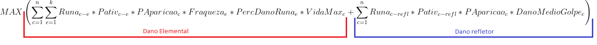

# Otimização de DPS no Tibia: Uma abordagem com pesquisa operacional

# Contextualização do problema

Tibia, lançado em 1998, é um dos primeiros MMORPGs que, mesmo após várias atualizações, mantém sua relevância como um dos maiores do gênero até hoje. As constantes melhorias no jogo introduziram uma diversidade de criaturas e locais de caça, cada uma apresentando estatísticas únicas como a vida máxima, fraquezas ou fortalezas á elementos, quantidade de golpes distintos, dano de cada golpe, dano por turno (DPS), além de outras estatísticas calculadas previamente (dado as características do meu personagem) como quantidade de turnos de dano que a criatura deve receber para morrer.

Existem diversas maneiras de aumentar o dano causado pelo personagem, sendo que neste estudo focaremos em duas: as runas elementais (físico, veneno, fogo, morte, sagrado, gelo) e as runas refletoras de dano. As runas podem ser alocada apenas em 1 criatura por runa, e cada criatura, por sua vez pode ter alocada apenas 1 runa.

As runas elementais concedem dano baseado na vida máxima da criatura e a sua chance de ativação é proporcional á quantidade de turnos de dano que ela recebe antes de morrer. Por outro lado a runa refletora de dano concede dano baseado no dano recebido pelo personagem, sua chance de ativação é proporcional á quantidade de turnos de dano que a criatura desfere antes de morrer.

Os locais de caça apresentam uma diversidade de criaturas, e a proporção de sua aparição varia também de acordo com o caminho escolhido pelo jogador para explorar e enfrentá-las repetidamente, buscando pontos de experiência.

O objetivo deste trabalho é responder à seguinte pergunta: dadas as restrições de alocação de runas, as características do local de caça (proporção de aparição de criaturas) e as estatísticas das criaturas, como vida máxima, dano aumentado ou reduzido á elementos, quantidade de golpes deferidos pela criatura, dano dos golpes e quantidade de golpes para derrotar cada criatura,   
**como devemos alocar as runas e em quais criaturas alocá-las para maximizar o dano adicional e extrair o máximo que um local de caça, pode oferecer? (como o dos elfos de fogo em Feyrist).**

# Estatisticas

## Criaturas
- Vida maxima da criatura
- Fraqueza / Resistência contra elemento de dano físico
- Fraqueza / Resistência contra elemento de dano de veneno
- Fraqueza / Resistência contra elemento de dano de fogo
- Fraqueza / Resistência contra elemento de dano de morte
- Fraqueza / Resistência contra elemento de dano de energia
- Fraqueza / Resistência contra elemento de dano sagrado
- Fraqueza / Resistência contra elemento de dano de gelo
- Quantidade de golpes distintos que a criatura pode deferir em 1 turno
- Dano médio dos golpes que a criatura pode deferir em 1 turno

## Local de caça
- Proporção de aparição da criatura dado o local de caça e o caminho escolhido para repetir.

## Personagem
- Número de golpes que criatura deve receber para ser derrotada dado as estatisticas do meu personagem (Armas, set, rotação de magia, talentos, skills, encantamentos (imbuements), chance de dano crítico etc) e as estatísticas da criatura (armadura, vida, fraquezas etc)

# Pesquisa Operacional

## Variáveis de decisão
Nesse estudo de caso são 6 criaturas e 8 runas distintas. Serão, portanto, 48 variáveis binárias para indicar se o conjunto [runa,criatura] estará habilitado (1) ou não (0).

## Função Objetivo
A função objetivo escolhida foi a maximização do DPS (dano por segundo) que foi dividida em duas equações. Uma referente as runas de dano elemental e outra referente as runas de dano refletido.
- 
## Restrição 1: Cada runa deve ter, no máximo, 1 criatura alocada
- 
- 
## Restrição 2: Cada criatura deve ter, no máximo, 1 runa alocada.
- 

# Resultados
A escolha de Runas que maximiza o DPS para o local de caça dos Elfos de Fogo para meu personagem foi:  

| Runa  | Criatura |
| ------------- | ------------- |
| Dano Físico  | Insane_Siren  |
| Dano Poison  | Lacewing_Moth  |
| Dano Fire  | -  |
| Dano Death  | Thanatursus  |
| Dano Energy  | Crazed Summer Rearguard   |
| Dano Holy  | Arachnophobica  |
| Dano Ice  | Crazed Summer Vanguard |
| Reflect  | - |
   
- No código, é realizada uma comparação entre os resultados da pesquisa operacional e o algoritmo de força bruta para validar os resultados. Ambas as técnicas convergiram para a mesma alocação de runas.
- Observa-se que a runa de dano de Fogo não foi escolhida no algoritmo, possivelmente devido à resistência ao fogo das criaturas enfrentadas no local de caça escolhido (Elfos de Fogo).
- Além disso, a runa de dano refletido também não foi alocada para esse local de caça. Dada as estatísticas das criaturas nesse local, é mais vantajoso investir em runas elementais em comparação com runas refletoras.
- Não alocar a runa refletora de dano é contra-intuitivo na gameplay da profissão de Cavalheiros (Knights), já que a runa mais popular e mais priorizada em locais de caça. Para esse local de caça essa runa é superestimada. Isso mostra a importância de uma boa análise para alocar corretamente as runas.
