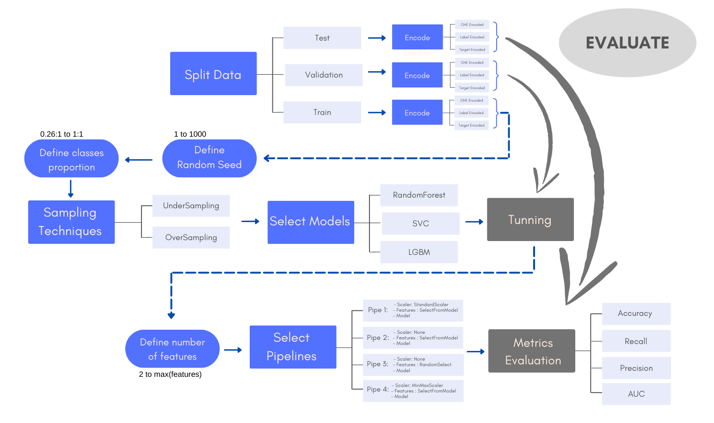

# Predição de Churn em clientes de bancos

# Projeto
- Detecção de Churn - Classificação

# Repositório
-Churn Predictions for Bank Customers-V2.ipynb - Notebook com EDA, limpeza, amostragem, balanceamento, pré-processamento, seleção de modelos, seleção de features, tunagem e métricas de modelos

# 1 Introdução 

Dados de clientes de um banco foram disponibilizados em um dataset no Kaggle. O dataset compõe dados de score de clientes, país de origem, idade, genero, posses, saldo em conta, numero de produtos adquiridos, salario estimado além de dados booleanos se possuem cartão de crédito e é membro ativo. Cada cliente foi rotulado em clientes que deram churn (rótulo = 1) e não deram churn (rótulo = 0)

https://www.kaggle.com/datasets/adammaus/predicting-churn-for-bank-customers

Os dados são naturalmente desbalanceados, o número de clientes que deram churn registrados corresponde à apenas 26% da base. 

# 2 Objetivos

O objetivo desse projeto é criar um modelo que seja capaz de identificar corretamente o perfil de clientes que dão Churn para que, dessa forma, a equipe de marketing possa trabalhar em uma campanha de fidelização, ou fornecer incentivos a permanência desses clientes

# 3 Metodologia

- Análise Exploratória: Uma analise exploratória dos dados foi conduzida no próprio notebook para traçar o perfil de clientes propensos a churn
- Limpeza: Etapas inicias de limpeza para remoção de ruidos
- Amostragem: Realizado uma amostragem com dados de 20% fraudes e 80% transações comuns
- Prototipação: Realizado balanceamento experimentais e uma primeira etapa de prototipação com a biblioteca LazyPredict para determinar os modelos candidatos

As seguintes etapas foram automatizadas no scripts e testadas diversas combinações para chegar ao melhor modelo conforme o esquema acima:
- Determinação do fator de balanceamento nos dados de treino  
- Tipo de Encode: LabelEncoder, OneHotEncoder, TargetEncoder  
- Determinação da quantidade de features  
- Tunning e determinação do melhor conjunto de hiperparâmetros  
- Determinação do melhor conjunto de features  
- Testes com pipelines com normalização  
- Testes com pipelines sem normalização  
- Testes com pipelines com seleção aleatória de features  
- Testes com pipelines com seleção de features por meio da função SelectFromModel do scikit-learn  

# Resultados
  
  O modelo LGBM foi eleito como melhor preditor e apresenta as seguinte performance nos dados de validação:
  
  Revocação classe 1 - Churn: 70,02%  
  Revocação classe 0 - Clientes que nao deram churn: 86,44%  
  Acurácia: 83,31%  
  AUC:  0,7823  

# Stack
Numpy, Pandas, Scikit-Learn, Matplotlib, Seaborn, Lazypredict,
