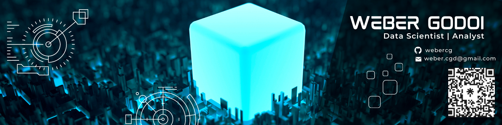

Esse é um repositorio onde estão armazenados os meus projetos de data science, machine learning e deep learning

# Projetos :

 - [CreditCard Fraud](https://github.com/webercg/Data-Science-Projects/tree/main/CreditCard%20Fraud)
 - [NLP: Daily-News-for-Stock-Market-Prediction](https://github.com/webercg/NLP---Daily-News-for-Stock-Market-Prediction)
 - [Olist-Ecommerce](https://github.com/webercg/Data-Science-Projects/tree/main/Olist---Ecommerce)
 - [Spotify-popularity-predictions](https://github.com/webercg/Data-Science-Projects/tree/main/Spotify-popularity-predictions-TCC-UTFPR)
 - [Agencia de Turismo](https://github.com/webercg/Entrada-de-Turistas)
 - [Health-Insurance-Cross-Sell-Prediction](https://github.com/webercg/Data-Science-Projects/tree/main/Health-Insurance-Cross-Sell-Prediction)

 # Sobre mim :
 
 Sou Engenheiro Químico de formação pela Escola Politécnica da Universidade de São Paulo (Poli-USP) e Especialista em Ciência de Dados pela UTFPR. Encontrei a minha paixão por dados durante meu estágio em uma distribuidora de produtos de limpeza em 2018 onde encabecei e desenvolvi um projeto voltado á automação do processo de compras em que o produto final foi um relatório de sugestão de compas baseado no nível de estoques, previsão de vendas, tempo de entrega por fornecedor, checagem de atendimento ao pedido mínimo, checagem de produtos com riscos de ruptura de estoque e tempo de entrega por fornecedores. 
 
Mesmo após a breve experiência com Engenharia trabalhando em uma fabrica de baterias eu sempre me encatava em resolver problemas de I.T como, por exemplo, reorganizar as informações da equipe de controle de qualidade para facilitar a visibilidade da área aos gestores, reorganizar os dados para facilitar a rastreabilidade de produtos e materias primas defeituosas.

Atuei por 2 anos como consultor de T.I em uma consultoria de software de gestao de laboratórios (LIMS). Com pouco tempo de experiência fui promovido a lider de equipe e além de realizar a gestão do contrato de suporte do cliente, realizava o entendimento de regras de negócio e levantamento de requisitos, parte das demandas geradas eram repassado à minha equipe e outra parte eu executava. 

Atuei com desenvolvimento de relatórios em Crystal (SAP), automação de processos em laboratórios (Análises, Testes, CQ, Projetos, Banco de dados, Relatórios Crystal, Relatórios Excel) e atendimento de chamados de suporte aos clientes BRF, Petrobras, Suzano, Avon, O Boticario, PQS.

Atualmente, sigo realizando projetos de Data Science como Freelancer na plataforma Workana e realizo cursos extras de Ciência de Dados, Estatistica e Engenharia de Dados na plataforma Stack Tecnologias.
 
